# 📚 Quant Hedge Fund - Complete Documentation

This documentation provides an in-depth, step-by-step explanation of every component in the Quant Hedge Fund system. Whether you're a beginner or an experienced quant, this guide will help you understand how each piece works together.

---

## Table of Contents

1. [Introduction](#1-introduction)
2. [System Architecture Explained](#2-system-architecture-explained)
3. [The Data Layer (QS Connect)](#3-the-data-layer-qs-connect)
4. [The Research Layer (QS Research)](#4-the-research-layer-qs-research)
5. [The Execution Layer (Omega)](#5-the-execution-layer-omega)
6. [The Orchestration Layer](#6-the-orchestration-layer)
7. [The Dashboard](#7-the-dashboard)
8. [Step-by-Step Workflow](#8-step-by-step-workflow)
9. [Understanding the Momentum Strategy](#9-understanding-the-momentum-strategy)
10. [MLflow Experiment Tracking](#10-mlflow-experiment-tracking)
11. [Production Deployment](#11-production-deployment)
12. [Advanced Topics](#12-advanced-topics)

---

## 1. Introduction

### What is a Quant Hedge Fund?

A **quantitative hedge fund** uses mathematical models, algorithms, and computer programs to make investment decisions. Unlike traditional funds that rely on human judgment, quant funds automate the entire process:

1. **Collect data** - Market prices, company financials, economic indicators
2. **Build models** - Statistical models that predict future returns
3. **Backtest** - Test the strategy on historical data
4. **Execute** - Automatically place trades based on the model's signals
5. **Monitor** - Track performance and adjust as needed

This system gives you all the tools to build your own quant fund.

### Why Python?

Python has become the standard language for quantitative finance because:

- **Rich ecosystem** - pandas, numpy, scikit-learn, etc.
- **Readable syntax** - Easy to understand and modify
- **Great libraries** - Zipline, MLflow, Interactive Brokers API
- **Community support** - Vast resources and documentation

### The Philosophy Behind This System

The system is built on three core principles:

1. **Reproducibility** - Every backtest is logged with its full configuration
2. **Modularity** - Each component can be modified independently
3. **Automation** - Once set up, the system runs without manual intervention

---

## 2. System Architecture Explained

### The Layered Approach

The system is divided into **five distinct layers**, each with a specific responsibility:

#### Layer 1: Data Layer (QS Connect)

**Purpose:** Collect, store, and manage all market data.

**Why it matters:** Good data is the foundation of any trading strategy. The data layer ensures you have clean, accurate, and up-to-date information for your models.

**Key components:**
- **FMP Client** - Downloads data from Financial Modeling Prep API
- **DuckDB Manager** - Stores data in a high-performance columnar database
- **Cache Manager** - Saves raw API responses to avoid re-downloading
- **Zipline Bundler** - Converts data to format needed by backtesting engine

**How it works:**


#### Layer 2: Research Layer (QS Research)

**Purpose:** Develop, test, and analyze trading strategies.

**Why it matters:** This is where the magic happens. You build factors (signals), run backtests, and evaluate performance.

**Key components:**
- **Factor Engine** - Calculates quantitative factors (momentum, value, etc.)
- **Preprocessors** - Clean and filter the stock universe
- **Backtest Runner** - Executes strategies on historical data
- **Performance Metrics** - Calculates 88+ statistics about the strategy
- **Tear Sheets** - Generates professional analysis reports

**How it works:**


 
 #### Layer 2.5: Real-Time Inference (TIP-Search)
 
 **Purpose:** Perform ultra-low latency inference for live trading.
 
 **Why it matters:** Markets move in milliseconds. This layer ensures you never miss a deadline by dynamically selecting the most accurate model that fits the current time budget.
 
 **Key components:**
 - **InferenceTask** - Represents a market tick with a strict nanosecond deadline
 - **ModelWrapper** - Wraps models with latency profiles and accuracy estimators
 - **TIPSearchScheduler** - The brain that picks the best model in $O(K)$ time
 
 **How it works:**
 
 ```mermaid
 flowchart TD
  A["Market Tick"] --> B["Scheduler"]
  B --> C{Check Deadline}
  C -- Tight Budget --> D["Fast Model (CNN)"]
  C -- Loose Budget --> E["Slow Model (Transformer)"]
  D --> F["Signal"]
  E --> F
  
  style C fill:#e6550d,color:#fff
  style D fill:#3182bd,color:#fff
  style E fill:#3182bd,color:#fff
 ```

#### Layer 3: Execution Layer (Omega)

**Purpose:** Convert backtest signals to real trades.

**Why it matters:** The best strategy is useless if you can't execute it. Omega bridges the gap between research and reality.

**Key components:**
- **Trading App** - Connects to Interactive Brokers
- **Order Management** - Submits, modifies, and cancels orders
- **Position Tracking** - Monitors your current holdings
- **Zipline Converter** - Converts backtest output to broker orders

**How it works:**


#### Layer 4: Orchestration Layer

**Purpose:** Automate the entire pipeline.

**Why it matters:** Running each step manually is tedious and error-prone. Orchestration ensures everything runs in the right order at the right time.

**Key components:**
- **Luigi** - Lightweight orchestration for development
- **Prefect** - Production-grade scheduling and monitoring

**How it works:**



```mermaid
flowchart TD
 A["⏰ Scheduler"] --> B["Task 1: Download Data"]
 B --> C["Task 2: Build Bundle"]
 C --> D["Task 3: Run Backtest"]
 D --> E["Task 4: Execute Trades"]
 
 style A fill:#024DFD,color:#fff
 style E fill:#00ff88,color:#000
```

#### Layer 5: Monitoring Layer

**Purpose:** Visualize and track everything.

**Why it matters:** You need to know how your system is performing in real-time.

**Key components:**
- **Streamlit Dashboard** - Real-time web interface
- **MLflow UI** - Experiment tracking and comparison

---

## 3. The Data Layer (QS Connect)

### Understanding the Data Pipeline

The data layer is the foundation of the entire system. Let me walk you through exactly how data flows from the API to your backtest.

### Step 1: Connecting to the API

The first step is establishing a connection to the FMP (Financial Modeling Prep) API. This API provides historical price data and fundamental data for thousands of stocks.

```python
from qsconnect import Client

# The Client class handles everything
client = Client()
```

**What happens behind the scenes:**

1. The `Client` reads your `FMP_API_KEY` from environment variables
2. It initializes an HTTP client with rate limiting (300 requests/minute)
3. It sets up connections to the cache manager and database

### Step 2: Downloading Price Data

Price data is the most important data for any trading strategy. Here's how to download it:

```python
from datetime import date

prices = client.bulk_historical_prices(
 start_date=date(2015, 1, 1),
 end_date=date.today(),
)
```

**What happens behind the scenes:**

1. **Check cache** - First, the system checks if data is already cached locally
2. **Call API** - For missing data, it calls the FMP API
3. **Cache response** - Raw responses are saved as Parquet files
4. **Load to database** - Data is inserted into DuckDB
5. **Return data** - A Polars DataFrame is returned

**Data format:**

| date | open | high | low | close | volume | symbol |
|------|------|------|-----|-------|--------|--------|
| 2024-01-02 | 185.50 | 186.74 | 184.89 | 185.82 | 58,414,460 | AAPL |
| 2024-01-03 | 184.22 | 185.88 | 183.43 | 184.25 | 71,983,560 | AAPL |

### Step 3: Downloading Fundamental Data

Fundamental data includes financial statements that help evaluate company value:

```python
client.fetch_bulk_financial_statements(
 statement_type=[
 "income-statement", # Revenue, expenses, profit
 "balance-sheet-statement", # Assets, liabilities
 "cash-flow-statement", # Cash generation
 "ratios", # P/E, P/B, ROE, etc.
 ],
 periods="all", # Both annual and quarterly
 start_year=2000,
 end_year=2025,
)
```

**Why this matters:**

Fundamental data enables strategies like:
- **Value investing** - Buy stocks with low P/E ratios
- **Quality investing** - Buy stocks with high ROE
- **Growth investing** - Buy stocks with high revenue growth

### Step 4: The DuckDB Database

All data is stored in DuckDB, a high-performance analytical database. DuckDB is:

- **Fast** - Columnar storage optimized for analytics
- **Lightweight** - Single file, no server needed
- **SQL-compatible** - Use standard SQL queries

**Database schema:**

```sql
-- Prices table
CREATE TABLE prices (
 date DATE,
 symbol VARCHAR,
 open DOUBLE,
 high DOUBLE,
 low DOUBLE,
 close DOUBLE,
 volume BIGINT,
 adj_close DOUBLE,
 PRIMARY KEY (date, symbol)
);

-- Stock list table
CREATE TABLE stock_list (
 symbol VARCHAR PRIMARY KEY,
 name VARCHAR,
 exchange VARCHAR,
 type VARCHAR,
 sector VARCHAR,
 industry VARCHAR
);
```

**Querying data:**

```python
# Get all Apple data
df = client.query("""
 SELECT *
 FROM prices
 WHERE symbol = 'AAPL'
 ORDER BY date DESC
 LIMIT 100
""")
```

### Step 5: Building Zipline Bundles

Zipline is our backtesting engine. It requires data in a specific format called "bundles."

```python
# Step 1: Write bundle files
client.build_zipline_bundle("historical_prices_fmp")

# Step 2: Register bundle with Zipline
client.register_bundle("historical_prices_fmp")

# Step 3: Ingest bundle into Zipline
client.ingest_bundle("historical_prices_fmp")
```

**What a bundle contains:**

- **Daily bars** - OHLCV data indexed by asset and date
- **Adjustments** - Split and dividend adjustments
- **Asset database** - Mapping of symbols to assets

---

## 4. The Research Layer (QS Research)

### The Backtesting Process Explained

Backtesting is the process of testing a trading strategy on historical data. It answers the question: "If I had followed this strategy in the past, how much money would I have made?"

### Step 1: Loading Data

First, we load the historical data from our bundle:

```python
def load_data(bundle_name, start_date, end_date):
 """Load price data from Zipline bundle."""
 import polars as pl
 from config.settings import get_settings
 
 settings = get_settings()
 db_manager = DuckDBManager(settings.duckdb_path)
 
 prices = db_manager.query_prices(
 symbols=None, # All symbols
 start_date=start_date,
 end_date=end_date,
 )
 
 return prices
```

### Step 2: Preprocessing

Raw data needs cleaning before we can use it. Common preprocessing steps:

**Price Preprocessor:**
```python
from qsresearch.preprocessors import preprocess_price_data

cleaned_data = preprocess_price_data(
 raw_data,
 min_trading_days=504, # Need 2+ years of data
 remove_low_trading_days=True, # Remove stocks with gaps
 remove_large_gaps=True, # Remove price jumps > 50%
 remove_low_volume=True, # Remove illiquid stocks
)
```

**What each step does:**

1. **min_trading_days** - Ensures we have enough history for factor calculation
2. **remove_low_trading_days** - Eliminates stocks with too many missing days
3. **remove_large_gaps** - Removes data errors (e.g., 1000% daily moves)
4. **remove_low_volume** - Removes stocks we couldn't actually trade

**Universe Screener:**
```python
from qsresearch.preprocessors import universe_screener

filtered_data = universe_screener(
 cleaned_data,
 lookback_days=730, # 2 year lookback
 volume_top_n=500, # Top 500 by volume
 min_avg_volume=100000, # At least 100k shares/day
 min_avg_price=4.0, # At least $4 average price
 max_volatility=0.25, # Less than 25% annual volatility
)
```

**Why we screen:**
- We can only trade liquid stocks
- Penny stocks have higher transaction costs
- Extremely volatile stocks add unnecessary risk

### Step 3: Factor Calculation

A **factor** is a quantitative signal that predicts future returns. The QSMOM (Quant Science Momentum) factor is calculated as:

```python
from qsresearch.features.momentum import add_qsmom_features

data_with_factors = add_qsmom_features(
 filtered_data,
 fast_period=21, # 1 month
 slow_period=252, # 1 year
 signal_period=126, # 6 months
)
```

**The QSMOM formula:**

```
ROC(period) = (Price_today - Price_period_ago) / Price_period_ago

QSMOM = ROC(slow_period) - ROC(fast_period)
```

**Example calculation:**
- Stock price today: $100
- Price 252 days ago: $80
- Price 21 days ago: $98

```
ROC(252) = (100 - 80) / 80 = 0.25 (25%)
ROC(21) = (100 - 98) / 98 = 0.02 (2%)
QSMOM = 0.25 - 0.02 = 0.23 (23%)
```

**Why this works:**
- We want stocks with strong long-term momentum (high ROC(252))
- We subtract short-term momentum to avoid stocks that just spiked
- This captures genuine trends, not temporary moves

### Step 4: Running the Backtest

The backtest simulates trading the strategy:

```python
from qsresearch.backtest import run_backtest

config = {
 "experiment_name": "Momentum Strategy",
 "bundle_name": "historical_prices_fmp",
 "start_date": "2015-01-01",
 "end_date": "2024-12-31",
 "capital_base": 1_000_000,
 
 "algorithm": {
 "callable": "use_factor_as_signal",
 "params": {"top_n": 20}
 },
 
 "portfolio_strategy": {
 "func": "long_short_equal_weight_portfolio",
 "params": {"num_long_positions": 20}
 }
}

results = run_backtest(config, log_to_mlflow=True)
```

**What happens during the backtest:**

1. **Day 1:** Start with $1,000,000 cash
2. **Each day:**
 - Calculate factor values for all stocks
 - Rank stocks by factor
 - Select top 20 stocks
 - Calculate target weights (5% each)
 - Place orders to rebalance
 - Track P&L
3. **End:** Calculate final portfolio value and statistics

### Step 5: Performance Metrics

After the backtest, we calculate 88+ metrics:

```python
from qsresearch.portfolio_analysis import calculate_all_metrics

metrics = calculate_all_metrics(
 performance_df=results["performance"],
 benchmark_returns=spy_returns,
)
```

**Key metrics explained:**

| Metric | Formula | What It Means |
|--------|---------|---------------|
| **Total Return** | (Final - Initial) / Initial | How much money you made/lost |
| **CAGR** | (Final/Initial)^(1/years) - 1 | Annualized return |
| **Sharpe Ratio** | Mean(returns) / Std(returns) × √252 | Risk-adjusted return |
| **Max Drawdown** | Max peak-to-trough decline | Worst case scenario |
| **Win Rate** | Winning days / Total days | How often you make money |
| **Sortino Ratio** | Mean / Downside Std | Return per unit of downside risk |
| **Calmar Ratio** | CAGR / Max Drawdown | Return per unit of max loss |

**Interpreting results:**

- **Sharpe > 1.0** - Good risk-adjusted performance
- **Sharpe > 2.0** - Excellent risk-adjusted performance
- **Max Drawdown < 20%** - Reasonable risk management
- **Win Rate > 50%** - More winning days than losing days

---

## 5. The Execution Layer (Omega)

### From Backtest to Real Trading

The execution layer translates your strategy into actual trades. This is the "last mile" that makes everything real.

### Step 1: Connecting to Interactive Brokers

Interactive Brokers (IB) is a professional brokerage that provides an API for automated trading.

**Prerequisites:**
1. IB account (paper or live)
2. IB Gateway or Trader Workstation running
3. API connections enabled

```python
from omega import TradingApp

# Connect to paper trading (port 7497)
app = TradingApp(
 host="127.0.0.1",
 port=7497,
 client_id=1,
 paper_trading=True
)

# Establish connection
app.connect()
```

### Step 2: Getting Current Positions

Before placing orders, we need to know what we already own:

```python
positions = app.get_positions()

for pos in positions:
 print(f"""
 Symbol: {pos['symbol']}
 Quantity: {pos['quantity']} shares
 Avg Cost: ${pos['avg_cost']:.2f}
 Market Value: ${pos['market_value']:,.2f}
 """)
```

### Step 3: The order_target_percent Method

This is the most important method in Omega. It automatically calculates the orders needed to reach a target allocation:

```python
# Allocate 5% of portfolio to Apple
app.order_target_percent("AAPL", 0.05)
```

**What happens behind the scenes:**

1. **Get portfolio value** - e.g., $1,000,000
2. **Calculate target value** - 5% × $1,000,000 = $50,000
3. **Get current position** - e.g., 100 shares × $185 = $18,500
4. **Calculate difference** - $50,000 - $18,500 = $31,500
5. **Get current price** - $185
6. **Calculate shares** - $31,500 / $185 ≈ 170 shares
7. **Place order** - BUY 170 AAPL

### Step 4: Executing the Full Portfolio

To rebalance the entire portfolio based on bacrest results:

```python
from omega.utils.omega_trades_converter import omega_trades_from_zipline

# Get target positions from backtest
target_positions = [
 {"symbol": "AAPL", "weight": 0.05},
 {"symbol": "MSFT", "weight": 0.05},
 {"symbol": "GOOGL", "weight": 0.05},
 # ... 17 more positions
]

# Get current positions from broker
current_positions = app.get_positions()

# Execute rebalancing
for target in target_positions:
 app.order_target_percent(
 symbol=target["symbol"],
 target_percent=target["weight"]
 )

# Liquidate positions no longer in target
target_symbols = {t["symbol"] for t in target_positions}
for current in current_positions:
 if current["symbol"] not in target_symbols:
 app.liquidate_position(current["symbol"])
```

### Step 5: Overnight Order Execution

The system is designed to place orders overnight for next-day execution:

**Why overnight?**
- Strategy is not time-sensitive (portfolio rebalancing)
- Avoids intraday price fluctuations
- Allows market-on-open execution
- Simpler implementation

**Schedule:**
1. 6 PM - Market closes
2. 10 PM - Run database refresh
3. 2 AM - Run backtest
4. 3 AM - Generate orders
5. 9:30 AM - Orders execute at market open

---

## 6. The Orchestration Layer

### Why Orchestration Matters

Without orchestration, you'd have to manually:
1. Run the data download script
2. Wait for it to finish
3. Run the bundle builder
4. Wait for it to finish
5. Run the backtest
6. Wait for it to finish
7. Run the order execution

Orchestration automates this entire process.

### Luigi: Development Orchestration

Luigi is a Python library originally built by Spotify for workflow management.

**Key concepts:**
- **Task** - A unit of work (download data, run backtest)
- **Target** - The output of a task (check if done)
- **Dependency** - Tasks that must complete first

**Our Luigi DAG:**

```python
class DownloadPricesFMP(luigi.Task):
 """Download historical price data."""
 
 start_date = luigi.DateParameter()
 run_date = luigi.DateParameter()
 
 def requires(self):
 return None # No dependencies
 
 def output(self):
 return luigi.LocalTarget(f"cache/prices_{self.run_date}.done")
 
 def run(self):
 client = Client()
 client.bulk_historical_prices(self.start_date, self.run_date)
 Path(self.output().path).touch()


class RunBacktest(luigi.Task):
 """Run the trading strategy backtest."""
 
 def requires(self):
 return BuildZiplineBundle(...) # Must build bundle first
 
 def run(self):
 run_backtest(CONFIG)
```

**Dependency graph:**


**Running Luigi:**

```bash
# With local scheduler (development)
python -m workflow.dags.01_ingest_data ExecuteTrades \
 --start-date 2015-01-01 \
 --run-date 2025-12-30 \
 --local-scheduler

# With central scheduler (production)
luigid --port 8082 # Start scheduler
python -m workflow.dags.01_ingest_data ExecuteTrades ...
```

### Prefect: Production Orchestration

Prefect is a modern workflow orchestration platform with:
- Web UI for monitoring
- Scheduling
- Retries and error handling
- Cloud deployment options

**Our Prefect flows:**

```python
@flow(name="nightly-pipeline-orchestrator")
def nightly_orchestrator_flow():
 """Master flow that runs all nightly jobs."""
 
 run_date = date.today()
 
 # Step 1: Refresh database
 refresh_result = refresh_database(run_date)
 
 # Step 2: Run parameter sweep
 sweep_result = run_parameter_sweep(run_date)
 
 # Step 3: Run production backtest
 backtest_result = run_nightly_backtest(run_date)
 
 # Step 4: Update dashboard
 dashboard_result = generate_dashboard_snapshot(run_date)
 
 return {
 "refresh": refresh_result,
 "sweep": sweep_result,
 "backtest": backtest_result,
 "dashboard": dashboard_result,
 }
```

**Scheduling:**

```python
# Run at 1 AM, Tuesday through Saturday
schedule = CronSchedule(cron="0 1 * * 2-6")

Deployment.build_from_flow(
 flow=nightly_orchestrator_flow,
 name="nightly-pipeline",
 schedule=schedule,
).apply()
```

---

## 7. The Dashboard

### Streamlit Dashboard Overview

The dashboard provides real-time visibility into your trading system.

### Tab 1: Live Ops

**Purpose:** Monitor current performance and positions.

**Features:**
- Portfolio value and daily P&L
- Performance chart (strategy vs benchmark)
- Rolling returns table (MTD, QTD, YTD, 1Y)
- Active position weights

### Tab 2: Research Lab

**Purpose:** Explore individual stocks and factors.

**Features:**
- Symbol selector
- Factor signal history chart
- Current rankings table
- Company profile information

### Tab 3: Signal Charts

**Purpose:** Technical analysis for research.

**Features:**
- Candlestick price charts
- Technical indicators (SMA, EMA, Bollinger Bands)
- MACD and RSI
- Custom date ranges

### Tab 4: AI Quant Team

**Purpose:** Research assistant for natural language queries.

**Features:**
- Chat interface
- Query database with plain English
- Get factor explanations
- Analyze performance

---

## 8. Step-by-Step Workflow

### Daily Production Workflow

Here's exactly what happens every trading day:

**10:00 PM - Database Refresh**
```
1. Prefect triggers nightly-qsconnect-refresh
2. Download today's price data from FMP
3. Update DuckDB database
4. Log completion to Prefect
```

**1:00 AM - Master Orchestrator**
```
1. Prefect triggers nightly-pipeline-orchestrator
2. Runs all dependent tasks in sequence:
 a. Verify data freshness
 b. Build/update Zipline bundle
 c. Run production backtest
 d. Run parameter sweep (research)
 e. Generate dashboard snapshot
3. Log all results to MLflow
```

**2:00 AM - Backtest Complete**
```
1. Backtest generates target positions
2. Positions saved to artifacts
3. MLflow logs 88+ metrics
4. Dashboard data updated
```

**3:00 AM - Trade Execution (if enabled)**
```
1. Load target positions from backtest
2. Connect to Interactive Brokers
3. Get current positions
4. Calculate required trades
5. Submit orders (market-on-open)
6. Log orders to Prefect
```

**9:30 AM - Market Open**
```
1. Orders execute at market open
2. IB confirms fills
3. Positions updated in real-time
4. Dashboard reflects new holdings
```

**4:00 PM - Market Close**
```
1. Final P&L calculated
2. Dashboard shows daily performance
3. Cycle repeats
```

---

## 9. Understanding the Momentum Strategy

### The Academic Basis

Momentum investing is based on decades of academic research showing that stocks that have performed well recently tend to continue performing well.

**Key papers:**
- Jegadeesh & Titman (1993) - "Returns to Buying Winners and Selling Losers"
- Asness, Moskowitz & Pedersen (2013) - "Value and Momentum Everywhere"

### Why Momentum Works

Several theories explain momentum:

1. **Underreaction** - Investors are slow to process new information
2. **Confirmation bias** - Investors seek information confirming their views
3. **Herding** - Investors follow each other's trades
4. **Disposition effect** - Investors sell winners too early

### The QSMOM Factor

Our implementation uses a specific momentum formula:

```
QSMOM = 12-month return - 1-month return
```

**Why subtract the 1-month return?**
- Avoids "short-term reversal" effect
- Stocks that just spiked often reverse
- Captures genuine trends, not noise

### Strategy Parameters

| Parameter | Value | Rationale |
|-----------|-------|-----------|
| fast_period | 21 days | ~1 month of trading |
| slow_period | 252 days | 1 year of trading |
| signal_period | 126 days | 6 months for smoothing |
| top_n | 20 | Diversified but concentrated |
| rebalance | Monthly | Balance between turnover and capture |

### Historical Performance

Based on backtests from 2015-2024:

| Metric | Strategy | S&P 500 |
|--------|----------|---------|
| CAGR | ~15-20% | ~10% |
| Sharpe | ~1.2-1.8 | ~0.7 |
| Max Drawdown | ~25-35% | ~35% |
| Win Rate | ~55% | ~54% |

---

## 10. MLflow Experiment Tracking

### Why Track Experiments?

When developing strategies, you'll test hundreds of parameter combinations. Without tracking:
- You forget what you've tried
- You can't reproduce results
- You can't compare systematically

MLflow solves this.

### What Gets Logged

**Parameters (inputs):**
- Strategy configuration
- Factor settings
- Universe filters
- Rebalance frequency

**Metrics (outputs):**
- All 88+ performance metrics
- Daily/monthly/yearly statistics
- Risk measures
- Benchmark comparisons

**Artifacts (files):**
- Performance pickle file
- Strategy manifest JSON
- Weights CSV
- Rankings CSV
- Tear sheets (HTML)

### Using MLflow

**Start the server:**
```bash
mlflow server --port 5050
```

**View experiments:**
```
http://localhost:5050
```

**Compare runs:**
1. Select multiple runs
2. Click "Compare"
3. View metrics side-by-side
4. Analyze parameter differences

---

## 11. Production Deployment

### Moving to Production

When you're ready to trade real money:

**Step 1: Validate thoroughly**
- Run 10+ years of backtests
- Test in paper trading for 3+ months
- Verify all corner cases

**Step 2: Set up infrastructure**
- Dedicated server (cloud or local)
- Reliable internet connection
- UPS backup power
- Monitoring alerts

**Step 3: Configure IB**
- Switch to live account (port 7496)
- Set appropriate risk limits
- Enable order confirmations
- Test with small positions

**Step 4: Deploy flows**
```bash
# Deploy to Prefect Cloud
prefect cloud login
python automation/prefect_flows.py
```

**Step 5: Monitor**
- Check dashboard daily
- Review MLflow metrics
- Monitor order execution
- Set up email/Slack alerts

---

## 12. Advanced Topics

### Parameter Sweeps

Test many parameter combinations automatically:

```python
sweep_config = {
 "param_grid": {
 "fast_period": [21, 42, 63],
 "slow_period": [126, 252, 504],
 "top_n": [10, 20, 30, 40],
 }
}

# This tests 3 × 3 × 4 = 36 combinations
results = run_iterative_sweep(sweep_config)
```

### Multi-Factor Strategies

Combine multiple factors for potentially better results:

```python
factors = [
 ("momentum", 0.4), # 40% weight
 ("value", 0.3), # 30% weight
 ("quality", 0.3), # 30% weight
]

composite_score = sum(factor_value * weight for factor_value, weight in factors)
```

### Transaction Costs

Real trading has costs. Account for them in backtests:

```python
config = {
 "transaction_cost": 0.001, # 0.1% per trade
 "slippage": 0.0005, # 0.05% slippage
 "management_fee": 0.02, # 2% annual
}
```

### Risk Management

Add stop-losses and position limits:

```python
config = {
 "stop_loss_enabled": True,
 "stop_loss_pct": 0.15, # Sell if down 15%
 "max_position_size": 0.10, # Max 10% in any stock
 "max_sector_exposure": 0.30, # Max 30% in any sector
}
```

---

## 13. LLM Strategy Generator

The system includes an AI-powered research assistant that uses Groq's LLM for offline strategy generation.

**Key Features:**
- **Regime Analysis**: Classifies market as Bull Steady, Bull Volatile, Bear, or Sideways.
- **Multi-Candidate Generation**: Produces N distinct strategy variations (Balanced, Aggressive, Defensive).
- **Validation**: All LLM outputs are validated against strict constraints.
- **MLflow Logging**: Every generated candidate is logged for reproducibility.

```python
from qsresearch.llm import StrategyGenerator

generator = StrategyGenerator()
candidates = generator.generate_candidates(prices, n=3)
best = max(candidates, key=lambda c: run_backtest(c)['sharpe'])
```

> ⚠️ The LLM is used **offline** for research—NOT in execution paths.

---

## 14. Pre-Live Checklist

Before enabling live trading, complete `docs/PRE_LIVE_CHECKLIST.md`:

1. **Paper Trading**: Validate order lifecycle (Order → Ack → Fill).
2. **Latency Benchmarking**: Measure P50/P95/P99 for all hops.
3. **Risk-Trigger Testing**: Verify loss limits and kill switches work.
4. **Failure-Mode Testing**: Simulate disconnects, stale data, rejects.

> ⚠️ Skipping these steps means accepting **undefined behavior with real money**.

---

## Conclusion

This documentation covered the complete Quant Hedge Fund system:

1. **Data Layer** - Collecting and storing market data
2. **Research Layer** - Developing and testing strategies
3. **Execution Layer** - Trading with Interactive Brokers
4. **Orchestration** - Automating the workflow
5. **Dashboard** - Monitoring performance

The system is designed to be:
- **Modular** - Change any component independently
- **Reproducible** - Every backtest is logged
- **Automated** - Runs without manual intervention
- **Professional** - Institutional-quality tools

Start small, paper trade extensively, and only move to live trading when you're confident in your strategy.

Good luck with your quant journey!

---

*For support and updates, visit the Quant Science community.*
