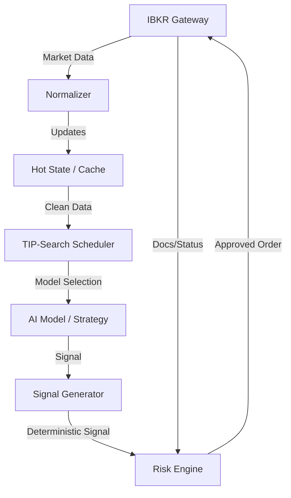

# IBKR Production Checklist for AI Trading Systems

**Objective**: Ensure latency, reliability, and account safety when integrating Interactive Brokers (IBKR) with the Quant Hedge Fund system (Omega Layer).

## 1. Environment & Connectivity
- [ ] **Use IB Gateway for Production**: Use TWS only for development/GUI. Gateway provides lower latency and fewer UI freezes.
- [ ] **Respect Latency Reality**: Design for 10–100ms latency. This system is Intraday/Low-Latency, NOT Microsecond HFT.

## 2. Market Data Handling
- [ ] **No Aggressive Polling**: Use event-driven data streaming (`reqMktData`).
- [ ] **Normalize Data**: Convert raw API events to internal standard formats before feeding to AI/Strategy.
- [ ] **In-Memory Caching**: Use a "Hot State" (e.g., Redis or in-app cache) for latest prices to avoid blocking on API calls.
- [ ] **Data Flow**: `IBKR API` -> `Normalizer` -> `Hot State` -> `Strategy Engine`.

## 3. Account & Contract Safety
- [ ] **Contract Verification**: Validate all `Contract` objects (`reqContractDetails`) at startup. Fail fast if permissions are missing.
- [ ] **Permission Check**: Ensure account has permissions for all asset classes (Stocks, Options, Futures) and Exchange routing (SMART).

## 4. Execution Strategy
- [ ] **Order Types**:
    - [ ] **Avoid Market Orders**: Use `Adaptive Limit` orders or slicing to reduce impact.
    - [ ] **Use Brackets**: Attach `TakeProfit` and `StopLoss` to every entry order for risk containment.
- [ ] **Async State Machine**: Treat orders as asynchronous states (Pending -> PreSubmitted -> Filled). Handle `orderStatus` and `execDetails` callbacks strictly.

## 5. AI & Logic Separation
- [ ] **AI Placement**:
    - ✅ **Offline/Async**: Strategy Generation, Parameter Tuning, Regime Detection.
    - ❌ **Hot Path**: Order submission loop, Risk checks, Tick processing.
- [ ] **Determinism**: The core trading loop must remain deterministic and robust, even if the AI model is unavailable.

## 6. Risk Management (Kill Switches)
**Mandatory constraints before enabling live trading:**
- [ ] **Max Loss per Day**: Force halt if PnL drops below $X.
- [ ] **Max Position Size**: Hard limit on quantity/notional per symbol.
- [ ] **Max Order Rate**: Throttle order submissions to prevent runaways.
- [ ] **API Error Halt**: Auto-disconnect on critical API errors (e.g., connectivity loss).

## 7. Rate Limiting
- [ ] **Client-Side Throttling**: Implement queues and backoff logic for `reqHistoricalData` and order placement to avoid IBKR bans.

## 8. Paper Trading Validation
**Run a full day in Paper Trading to verify:**
- [ ] Order Fills & Partials
- [ ] Callback latencies
- [ ] Risk Engine enforcement
- [ ] PnL calculation accuracy

---

**Architecture Diagram**

